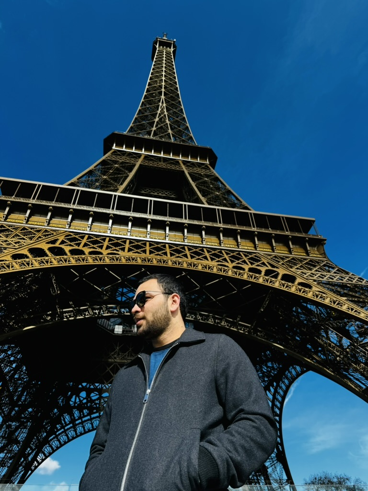
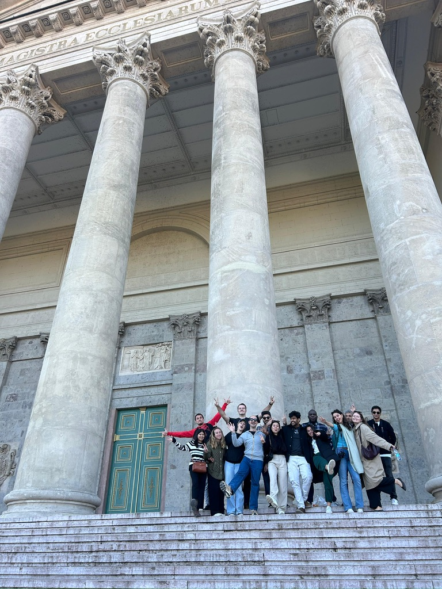

As 2024 draws to a close, I'm taking a moment to reflect on some of the year's highlights
## Travel
Having lived in Pakistan for 24 years, where international travel was a luxury for many, I was determined to make the most of my time in Europe. Exploring different countries and cities has always been a significant part of my plans. This year, I visited nearly 12 cities, some of which I returned to multiple times. Here's a summary of my travels this year.
- **Frankfurt**: My first trip of the year to Frankfurt was a great experience. I met an old college friend there and visited Heidelberg. However, the highlight of this trip was the loss of two laptops, which were stolen from my bag on the ICE train on my way back to the Netherlands.

  

- **Brussels and Paris**: This trip was special because one of my university friends from Malta visited me in the Netherlands, and we planned to see Brussels and Paris together. Paris, and especially the Eiffel Tower, has always been a place I longed to visit. Back in Pakistan, it was all I ever heard about Paris, so experiencing it with a university friend was truly a fun experience.

  

- **Brussels and Ghent**: I couldn't get enough of Brussels during my last visit, as I only had one day to explore this amazing city. Therefore, I planned another trip, this time including Ghent. I thoroughly enjoyed the lively atmosphere of the Brussels city center and the charming, peaceful vibes of beautiful Ghent.

 

- **Berlin**: In late June, a friend living in Berlin invited me to visit him. I enthusiastically agreed, as Berlin is an incredible city with so much to offer. It was a short weekend trip, but I had the opportunity to explore the city and spend time with my friend.

- **London**: London is one city I have always yearned to revisit, as it's one I've always heard about back in Pakistan. I finally secured my visa in mid-June, and it was time to explore this vibrant, multicultural city. The experience was truly amazing. I felt completely at home seeing so many people from my part of the world, enjoying the diverse Pakistani cuisine, and even encountering numerous university friends and acquaintances from my old neighborhood in Pakistan.

  

- **Salzburg and Vienna**: Visiting Austria had always been a goal, and as one of the closest countries to the Netherlands, it was a logical choice. A friend had highly recommended Salzburg, so I planned a week-long trip to explore these beautiful cities. Salzburg was enchanting; I absolutely adored the city's charm. Vienna, on the other hand, offered all the vibrancy of a major capital. I was particularly captivated by St. Stephen's Cathedral. Its architecture truly inspired me, deepening my appreciation for these magnificent historical cathedrals.

  

- **London**: I still had a valid visa, and since London always deserves a second visit, I returned in August. This trip exceeded my first.

- **Budapest**: Budapest has always been a popular tourist destination, so in September, I decided to explore the city on a solo trip. It was enjoyable, and I liked the city, but I didn't enjoy it as much as I hope for.

 

- **Budapest and Brativslava**: Hands down, the most memorable trip of 2024 was a company-organized business trip to Budapest and Bratislava with 25 colleagues I had never met before. It turned out to be an incredible experience filled with amazing people, delicious food, and unforgettable moments. I realized that what I missed during my previous solo trip to Budapest was the companionship of good people. We also visited the charming city of Bratislava, which was lovely. However, the highlight of the trip was undoubtedly getting to know such wonderful colleagues and creating some of the best memories of my life with them.

  

- Berlin: I visited Berlin again in October with some friends for a tech conference. The conference itself was average, but exploring Berlin with my friends was definitely a highlight.

- Cologne: The last trip of the year was in December to Cologne, where I visited the magnificent cologne cathedral and explored the famous Christmas markets with some friends.

  
